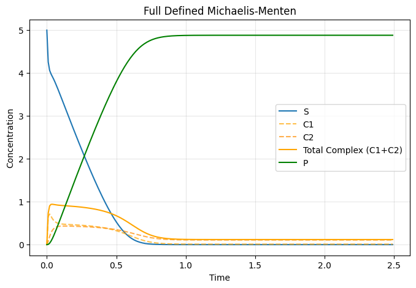
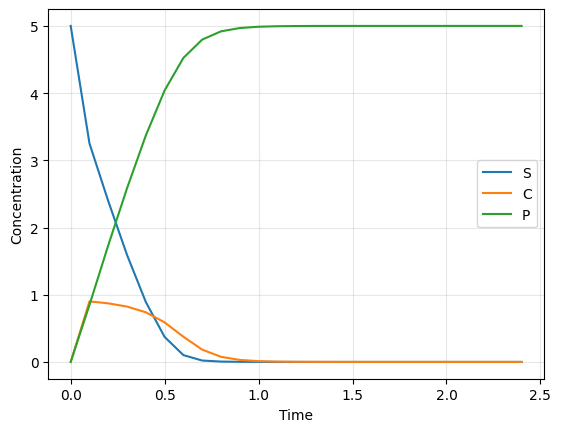

# CBA01-Michaelis-Menten-Case
This is Computational Biology Assignment which we have to model Michaelis Menten Reaction 

## Reaction Network Michaelis Menten Full Defined 
$$
\underbrace{S}_{\text{substrate}} + \underbrace{E}_{\text{free enzyme}} \rightleftharpoons \underbrace{C_1}_{\text{enzyme-substrate complex}} \rightleftharpoons \underbrace{C_2}_{\text{enzyme-product complex}} \rightleftharpoons \underbrace{P}_{\text{product}} + \underbrace{E}_{\text{free enzyme}}
$$

We can define the reaction rate below.

$$v_1 = k_1 [S][E]$$
$$v_{-1} = k_{-1} [C_1]$$
$$v_2 = k_2 [C_1]$$
$$v_{-2} = k_{-2} [C_2]$$
$$v_3 = k_3 [C_2]$$
$$v_{-3} = k_{-3} [P][E]$$

The total concentration from this kinetics is The total enzyme concentration: $e_T = e + c_1 + c_2$. So, We can extract the different equations of kinetics as below. 

$$\frac{d}{dt} s(t) = -v_1 + v_{-1} = -k_1 s(t) e(t) + k_{-1} c_1(t)$$
$$\frac{d}{dt} e(t) = -v_1 + v_{-1} + v_3 - v_{-3} = -k_1 s(t) e(t) + k_{-1} c_1(t) + k_3 c_2(t) - k_{-3} p(t) e(t)$$
$$\frac{d}{dt} c_1(t) = v_1 - v_{-1} - v_2 + v_{-2} = k_1 s(t) e(t) - k_{-1} c_1(t) - k_2 c_1(t) + k_{-2} c_2(t)$$
$$\frac{d}{dt} c_2(t) = v_2 - v_{-2} - v_3 + v_{-3} = k_2 c_1(t) - k_{-2} c_2(t) - k_3 c_2(t) + k_{-3} p(t) e(t)$$
$$\frac{d}{dt} p(t) = v_3 - v_{-3} = k_3 c_2(t) - k_{-3} p(t) e(t)$$

## Reaction Network Michaelis Menten Simplified
There is simple form of the kinetics due to the assumption in substrate-complex and product complex in to one face. 
$S + E \underset{v_{-1}}{\overset{v_1}{\rightleftharpoons}} C \xrightarrow{v_2} P + E$

We can define the reaction rate below.

$$v_1 = k_1 [S][E]$$
$$v_{-1} = k_{-1} [C]$$
$$v_2 = k_2 [C]$$

The total enzyme concentration: $e_T = e + c$. 

$$\frac{d}{dt} s(t) = -v_1 + v_1 = -k_1 s(t) e(t) + k_{-1} c(t)$$
$$\frac{d}{dt} e(t) = -v_1 + v_{-1} = -k_1 s(t) e(t) + k_{-1} c(t)$$
$$\frac{d}{dt} c(t) = v_1 - v_{-1} - v_2 = k_1 s(t) e(t) - k_{-1} c(t) - k_2 c(t)$$
$$\frac{d}{dt} p(t) = v_2 = k_2 c(t)$$

Since enzyme is not consumed in the reaction, therefore enzyme is constant which can re-write as below
e(t) = e_T - c(t)

Therefore the equation for this case.

$$\frac{d}{dt} s(t) = -k_1 s(t) (e_T - c(t)) - k_{-1} c(t)$$
$$\frac{d}{dt} c(t) = k_1 s(t) (e_T - c(t)) - k_{-1} c(t) - k_2 c(t)$$
$$\frac{d}{dt} p(t) = k_2 c(t)$$

